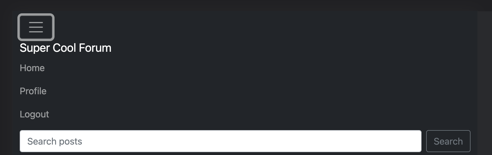
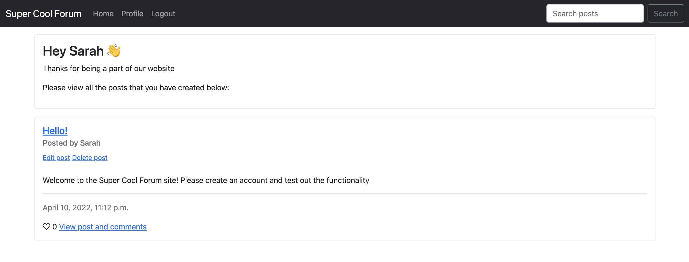

# Super Cool Forum

- [ 💻 Live website](https://super-cool-forum.herokuapp.com/)
- [ 🗂 GitHub. Repository](https://github.com/sarahjameson/CI-PP4-super_cool_forum)

## About

Super Cool Forum is a website where people can share their thoughts through posts and comments. It is a place where people can unite to test their writing skills out and their communication skills. The website is meant to be a safe haven from the hustle and bustle of life. It tries to go back to basics in terms of functionality and design which allows the users to truly concentrate on the task at hand as well as give their minds a break from the overstrimulation of life. Rest up and take it easy. You're using the Super Cool Forum now!

## Contents 

- [User Experience (UX)](#user-experience-ux)
   * [User Stories](#user-stories)
   
- [Design](#design)
   * [Colour Scheme](#colour-scheme)
   * [Typography](#typography)
   * [Wireframes](#wireframes)
   * [Database Schema](#database-schema)

- [Features](#features)
   * [Home page](#home-page)
   * [User profile](#user-profile)
   * [Searched posts](#searched-posts)
   * [Post detail page](#post-detail-page)
   * [Add post page](#add-post-page)
   * [Edit post page](#edit-post-page)
   * [Features to add](#features-to-add)

- [Technologies](#technologies)
   * [Languages used](#languages-used)
   * [Libraries & Programs Used](#libraries-and-programs-used)

- [Testing](#eat-me)
  
- [Deployment](#deployment)
   * [Github pages](#github)
   * [Django and Heroku](#django-and-heroku)
   * [Forking](#forking)
   * [Clone](#clone)

- [Credits](#credits)
   * [Code](#code)
   * [Media](#media)

## User Experience (UX)

A visitor to the Super Cool Forum site would be someone of any age who wishes to share their thoughts with the world.

## User Stories 

My starting user stories and their tasks can be found [here](https://github.com/sarahjameson/CI-PP4-super_cool_forum/issues?q=is%3Aissue+is%3Aclosed).

### Navigation
- As a User I can understand the website's purpose so that I know if it's what I'm looking for.
- As a User I can navigate around the site so that I can easily view desired content.
- As a User I can view a list of posts on the home page to late pick one to look at in more detail.
- As a User I can click on a post that I can read the comments on it.
- As a User I can search the pots's titles so that I can find related posts..

### User's Posts
- As a User I can create posts so that other users can view them and comments on them.
- As a User I can view all the posts that I have created (published or saved as draft) from my prodfile page so that I can see and manage all the posts.
- As a User I can edit posts so that I can update the post with any desired information or mistakes to my recipes.
- As a User I can delete my own posts so that I can remove any unwanted posts from my collection.

### User Interaction
- As a User I can like/unlike post so that I can share that I liked the post.
- As a User I can comment on posts so that I can share my opinions with others.
- As a User I can view the number of likes on a post so that I can see which is most popular.
- As a User I can view comments on posts so that I can read other user's opinions and see discussions in whole.

### Sign in
- As a User I can register for an account so that I can begin to use the services afforded to members.
- As a User I can log in/out so that I can like posts, comment on posts and manage my posts in terms of editing and deleting them.
- As a User I can see that my login status is reflected in the navbar in terms of links available so that I know if I'm logged in or out.

[Back to top ⇧](#super-cool-forum)

## Design

The look of this website is minimalist. I made this choice as I wanted the users mins to be free from any distracting design choices.

### Colour Scheme

- The colour scheme consists of black, gray and white throughout. Pops of colour are shown through the uses of emojis.

### Typography

- I use the default bootstrap fonts on the site as I find them very appealing as they are clean and easy to read.

### Wireframes

Wireframes for the project are linked here:

- [Link to repository with images](assets/images/wireframes/)

### Database Schema 

- [Database Schemas can be found here](assets/images/database-schemas)

[Back to top ⇧](#super-cool-forum)

## Features

### Home Page

- #### Navigation bar
    - The navigation bar is present at the top of every page and houses all links to the various other pages.
    - The options to Signup or Log in will change to the option to log out pr view profile once a user is logged in. 
    - A search bar is nested in the navbar to find desired posts quickly.
    - The navbar is fully responsive, collapsing into a hamburger menu when the screen size becomes too small. 

    
     

- #### Welcome banner
    - A welcome banner meets the user with a short message with a call-to-action. If logged out, the wbesite will urge the user to sign up or login.
    - If a user is already signed in the message changes to welcome user and there is a link to create a new post.

    
    

- #### User profile
    - The user can views all the posts that they have made from their profile page. These can include drafts and published posts.
    - Clicking each recipe takes you to its detail page.

    

- #### Post detail page
    - The user can like the post and view comments for a post as well as comment on them.

    
    

[Back to top ⇧](#super-cool-forum)

### Accounts
- #### Register Page
    - The register page is used to create an account.

    

- #### Login Page
    - The login page is used to log in already existing users.
    - A success message will appear once a user successfully logs in.

    

- #### Log out Page
    - The log out page is used to log out users who are already signed in.
    - The user will be redirected to a confirmation page.
    - A success message will then appear once a user successfully logs out after confirming logout.

    

[Back to top ⇧](#super-cool-forum)

### Home page

- #### List of posts from all users
    - The site will paginate posts to display 6 to a page.
    - Each post will display the title, author, content, published date and how many likes it has already gotten.
    - Clicking the title or the view comments links will bring the user to the post detail page.

    

### User Profile

- #### User published and draft posts
    - This page displays only the recipes that the user has created whether they be drafts or published posts.
    - Each recipe will have two links to either edit or delete the post.
    - The edit link will take users to the edit post page for that particular post.
    - Clicking the delete link will bring the user to a confirmation page to see if they areally want to delete the post.
    - It is not possible to access the profile site if the user is not logged in.

    

### Searched posts Page

- #### Searched posts
    - Anything entered into the search bar in the navigation bar bring the user to this page which presents the findings.
    - If the user forgets to enter anything, the result page will let them know.

    
    

[Back to top ⇧](#super-cool-forum)

### Posts

- #### Post card
    - This will show the title, author, published date and likes.

    

- #### Comments
    - At the bottom of the page, there is the comment section where you can view all comments left on a post.
    - Only signed in users can leave a comment.

    

### Add post page

- #### Adding posts
    - The adding posts page is where users can create posts.
    - Each post is uploaded by filling out a form.
    - Failing to fill out either the post title or body results in an error messages showing stating which fields you have missed.
    - Clicking the dropdown menu allow you to say whether you want a post published or as a draft.
    - A submit button is present at the bottom of the page once the form is ready to send.
    - There is no option to access this page for logged out users.

    

### Edit post Page

- #### Editing posts
    - Editing a post brings up the form that was filled in when the post was created and has all the fields filled out with that content.
    - Changing the content and hitting submit at the bottom of the forms saves the new version of the form over the older.
    - Only the original post author will be able to edit posts.

    

- #### Features to add
    - I would like to add functionality to edit and delete comments for the original commentors.
    - I would like to work more on the profile page. It would be nice and personable to have a biography for the user.
    - Further, it would be nice to be able to visit each user's profile page and see the bio. Of coutse, I would keep the draft posts hidden.
    - Speaking of the draft posts, I do not currently have a tag to show them as drafts so I would like to have that reflected in the future.

[Back to top ⇧](#super-cool-forum)

## Technologies

### Languages used

- [HTML5](https://en.wikipedia.org/wiki/HTML5)
- [CSS3](https://en.wikipedia.org/wiki/Cascading_Style_Sheets)
- [Javascript](https://en.wikipedia.org/wiki/JavaScript)
- [Python](https://www.python.org/)

### Libraries and Programs Used

- [Git](https://git-scm.com/)
    - Version control.
- [GitHub](https://github.com/)
    - For storing code and deploying the site.
- [Gitpod](https://www.gitpod.io/)
    - Used for building and editing my code.
- [Django](https://www.djangoproject.com/)
    - A python based framework that was used to develop the site.
- [Bootstrap](https://getbootstrap.com/)
    - For help designing the html templates.
- [Font Awesome](https://fontawesome.com/)
    - Used to obtain the icons used.
- [Google Developer Tools](https://developers.google.com/web/tools/chrome-devtools)
    - Used to help fix problem areas and identify bugs.
- [SQlite](https://www.sqlite.org/index.html)
    - Used when performing unit tests.
- [PostgreSQL](https://www.postgresql.org/)
    - Database used through heroku.
- [Balsamiq](https://balsamiq.com/)
    - To create the wireframes.
- [W3C Markup Validation Service](https://validator.w3.org/) 
    - Used to validate HTML code.
- [W3C CSS Validation Service](https://jigsaw.w3.org/css-validator/#validate_by_input)
    - Used to validate CSS code.
- [Pep8](http://pep8online.com/)
    - Used to validate Python code.
- [JSHint](https://jshint.com/)
    - Used to validate JS code.
- [Summernote](https://summernote.org/)
    - Used to add a WYSIWYG text box to the add recipe page.
- [Heroku](https://www.heroku.com/)
    - To deploy the project.

[Back to top ⇧](#super-cool-forum)

## Testing

### Validators

#### HTML5 validator
- [Index page](https://validator.w3.org/nu/?doc=https%3A%2F%2Fsuper-cool-forum.herokuapp.com%2F) - PASSES
- [Create post](https://validator.w3.org/nu/?doc=https%3A%2F%2Fsuper-cool-forum.herokuapp.com%2Fcreate-post) - PASSES
- [User profile](https://validator.w3.org/nu/?doc=https%3A%2F%2Fsuper-cool-forum.herokuapp.com%2Fuser-profile#textarea) - PASSES
- [Post detail](https://validator.w3.org/nu/?showsource=yes&doc=https%3A%2F%2Fsuper-cool-forum.herokuapp.com%2Fhello%2F) - PASSES
- [Edit post](https://validator.w3.org/nu/?showsource=yes&doc=https%3A%2F%2Fsuper-cool-forum.herokuapp.com%2Fedit%2Fhello) - PASSES

#### CSS validator
This test passes.

#### Javascript 
This test passes.

#### Python PEP8
There were inititally some failures due to spacing and line lengths. These have since all been corrected and all files are PEP8 friendly.

#### Lighthouse results

### Compatibility Testing
- The site looks the same on different browsers.
- The site is responsive across devices.

### User story testing

#### Navigation
- As a User I can understand the website's purpose so that I know if it's what I'm looking for.
    - The site logo is evident and there are post on the main page showing the type of content on the site.
    - There is a call to action whether you are logged in or not.
- As a User I can navigate around the site so that I can easily view desired content.
    - The links are clear on the navbar and work with the call-to-actions to let the user know what options are available to them.
- As a User I can view a list of posts on the home page to later pick one to look at in more detail.
    - The home page lists all published posts from members of the site.
    - The links in the title and in the call-to-action to view the comments show that the user can click through to view the post in more detail.
- As a User I can click on a post so that I can read the comments on it.
    - There link to view comments brings the user to the post detail page where the comments can be found at the bottom of the page.
- As a User I can search the posts's titles so that I can find related posts.
    - There is a search bar on the nav bar. It is easy to spot on the top right of the screen.
    - The user can enter any of the letters from a title and all relevant post will be shown on the results page.

#### User's Posts
- As a User I can create posts so that other users can view them and comments on them.
    - Logged in users can create posts. They are brought to a form. Once this is submitted, the new posts will appear on the home page and in the user's profile page.
    - Other users will see everyone else's published posts.
- As a User I can view all the posts that I have created (published or saved as draft) from my prodfile page so that I can see and manage all the posts.
    - The logged in user can navigate to the profile page to view all their posts
- As a User I can edit posts so that I can update the post with any desired information or mistakes to my recipes.
    - The original author is able to edit their own posts and save the new version over the other one. They are then redirected to the home page.
- As a User I can delete my own posts so that I can remove any unwanted posts from my collection.
    - The original author can delete their own posts. They are brought to a confirmation page. Once confirmed, they are brought to the home page.

#### User Interaction
- As a User I can like/unlike post so that I can share that I liked the post.
    - The logged in user can like and unlike posts. They are redirected to the same page which shows the liked/unliked heart.
- As a User I can comment on posts so that I can share my opinions with others.
    - The logged in user can comment on posts on the post detail page. Once they submit the form, they are redirected to the same page with the updated component.
- As a User I can view the number of likes on a post so that I can see which is most popular.
    - From the home page and post detail page, all users can see the likes on each post.
- As a User I can view comments on posts so that I can read other user's opinions and see discussions in whole.
    - From the post detail page, all users can view the different comments left on posts.

#### Sign in
- As a User I can register for an account so that I can begin to use the services afforded to members.
    - There is a clear sign up link in the navbar. From clicking that, the user is redirected to a form which they can submit to have their account created.
- As a User I can log in/out so that I can like posts, comment on posts and manage my posts in terms of editing and deleting them.
    - There is a clear log in and log out link in the navbar depending on if the user is logged in or not. If they login, they are brought to a form to fill out their credentials. If it is correct, they are directed to the home page. Otherwise, they will be prompted to enter the correct details. If they logout, they are brought to a confirmation page. Upon confirmation, they are directed to the home page as a logged out user.
- As a User I can see that my login status is reflected in the navbar in terms of links available so that I know if I'm logged in or out.
    - The logged in user can see the links 'home', 'profile' and 'logout' whereas the logged out user can see the links 'home', 'sign up' and 'login'. There is also a welcome banner on each of the main pages giving a call-to-action depending on if the user is logged in or not.

### Unit testing

Unit tests were written for forms, models and views.

## Deployment

This project was deployed using Github and Heroku.

- ### Github 

    To create a new repository I took the following steps:

    1. Logged into Github.
    2. Clicked over to the ‘repositories’ section.
    3. Clicked the green ‘new’ button. This takes you to the create new repository page.
    4. Once there under ‘repository template’ I chose the code institute template from the dropdown menu.
    5. I input a repository name then clicked the green ‘create repository button’ at the bottom of the page.
    6. Once created I opened the new repository and clicked the green ‘Gitpod’ button to create a workspace in Gitpod for editing.

- ### Django and Heroku

    To get the Django framework installed and set up I followed the Code institutes [Django Blog cheatsheet](https://codeinstitute.s3.amazonaws.com/fst/Django%20Blog%20Cheat%20Sheet%20v1.pdf).

    
- ### Forking

    To fork my project you must;
    1. Sign in to Github and go to my [repository](https://github.com/sarahjameson/CI-PP4-super_cool_forum)
    2. Locate the Fork button at the top right of the page.
    3. Select this. 
    4. The fork is now in your repositories.

- ### Clone
    To clone my project you must;

    1. Sign in to Github and go to my [repository](https://github.com/sarahjameson/CI-PP4-super_cool_forum)
    2. Above the list of files click the green ‘code’ button.
    3. This will bring up a few options as to how you would like to clone. You can select HTTPS, SSH or Github CLI, then click the clipboard icon to copy the URL.
    4. Open git bash
    5. Type ‘git clone’ and then paste the URL you copied. Press Enter.

    For more information on cloning check out the github documentation [here](https://docs.github.com/en/repositories/creating-and-managing-repositories/cloning-a-repository)

## Known bugs
- The comment form does not empty after submitting a comment.

## Credits
- Thank you to the Code Institute Django lectures for helping with the testing aspect and for setting up the project.
- I used the following youtube videos also for assistance:
    - [Codemy channel](https://www.youtube.com/watch?v=8NPOwmtupiI&list=PLCC34OHNcOtr025c1kHSPrnP18YPB-NFi&index=7&ab_channel=Codemy.com)
    - [Traversy Media channel](https://www.youtube.com/watch?v=PtQiiknWUcI&t=8032s&ab_channel=TraversyMedia)

[Back to top ⇧](#super-cool-forum)